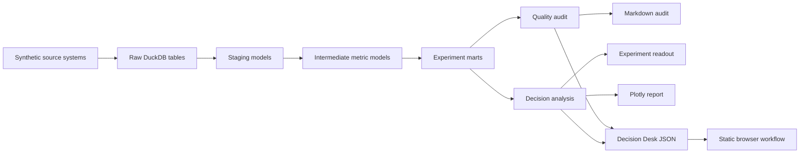

# Architecture

Experiment Forge is a local product experimentation analytics platform with a static, credential-free Decision Desk. It mirrors the shape of a real analytics engineering workflow while staying fully cloneable on a laptop and deployable as a small public artifact-backed site.

## System Flow

## Layers

- `data_generation/`: deterministic source-system simulator for users, assignments, product events, sessions, orders, feature exposures, support tickets, and daily snapshots.
- `warehouse/`: DuckDB build system and SQL models organized into staging, intermediate, and mart layers.
- `quality/`: source, warehouse, and experiment-validity checks.
- `analysis/`: statistical readout, practical significance, multiple-testing adjustment, and launch/stop/continue/investigate decisioning.
- `reporting/`: Markdown reports and the existing Plotly HTML dashboard.
- `web_artifacts.py`: deterministic build contract from generated pipeline outputs to browser JSON.
- `web/`: responsive browser UI, local CSV schema validator, and committed sample payloads.
- `forge.py`: CLI workflow that ties the platform together.

## Why DuckDB

DuckDB gives the project a warehouse-like SQL surface without cloud credentials. That makes the repo easy to clone while still demonstrating analytics engineering fundamentals: raw-to-staging contracts, modeled marts, tests, and business-facing outputs.

The browser deliberately consumes generated artifacts rather than duplicating analysis logic in JavaScript. This keeps the product deployable as static files while preserving a visible lineage back to Python, SQL, DuckDB, the quality audit, and the statistical readout.
