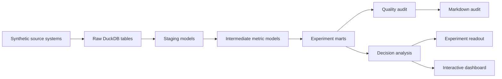

# Architecture

Product Experiments is a local product experimentation analytics platform. It mirrors the shape of a real analytics engineering workflow while staying fully cloneable on a laptop.

## System Flow

## Layers

- `data_generation/`: deterministic source-system simulator for users, assignments, product events, sessions, orders, feature exposures, support tickets, and daily snapshots.
- `warehouse/`: DuckDB build system and SQL models organized into staging, intermediate, and mart layers.
- `quality/`: source, warehouse, and experiment-validity checks.
- `analysis/`: statistical readout and launch/hold/iterate decisioning.
- `reporting/`: Markdown reports and Plotly HTML dashboard.
- `forge.py`: CLI workflow that ties the platform together.

## Why DuckDB

DuckDB gives the project a warehouse-like SQL surface without cloud credentials. That makes the repo easy to clone while still demonstrating analytics engineering fundamentals: raw-to-staging contracts, modeled marts, tests, and business-facing outputs.
