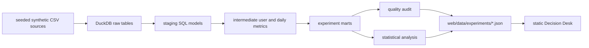

# Data Lineage

The Decision Desk is artifact-backed. The browser does not invent analytical values in JavaScript and it does not connect to a production account.

`python3 forge.py web-build --workspace . --output web/data` performs the complete flow for both sample profiles. Each payload includes:

- deterministic seed and requested/generated user count;
- source CSV row counts and SHA-256 hashes;
- the quality audit checks and thresholds;
- variant, guardrail, segment, daily-trend, and experiment-health mart rows;
- the analysis decision, confidence interval, practical threshold, and multiple-testing evidence;
- the lineage list shown in the browser.

The raw data files are generated by `data_generation/synthetic_product.py`. The warehouse contract is defined by the SQL files under `warehouse/models/`. The browser payload assembly lives in `web_artifacts.py`.
